# 3D-Agent

An autonomous coding agent built on [LangGraph](https://langchain-ai.github.io/langgraph/) and
[deepagents](https://github.com/langchain-ai/deepagents). It plans, executes, and verifies real
changes against a real project checkout, with human approval required for anything risky. It also
runs **Planning Chat**, a separate conversational assistant for research and design discussion that
remembers what it learns across sessions and can hand a finished plan straight to the build
pipeline.

The backend is a FastAPI app (`agent/server.py`); the frontend is React/Vite. Together they cover
submitting and watching build tasks, chatting with Planning Chat, and administering models, users,
and repos.

The agent targets a fixed set of local projects (`PROJECTS` in `agent/config.py` /
`projects.json`). Each task runs against that project's own **workspace** — a git worktree of the
live repo at `/home/agent-workspaces/<project>`, on a per-task branch `agent/<task-id>` — one task per project
at a time, enforced by an in-process lock.

## Screenshots

<table>
<tr>
<td width="50%">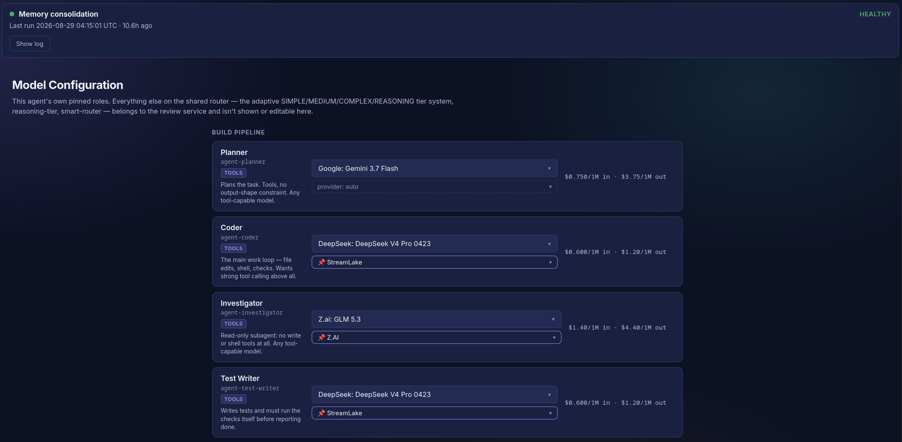</td>
<td width="50%">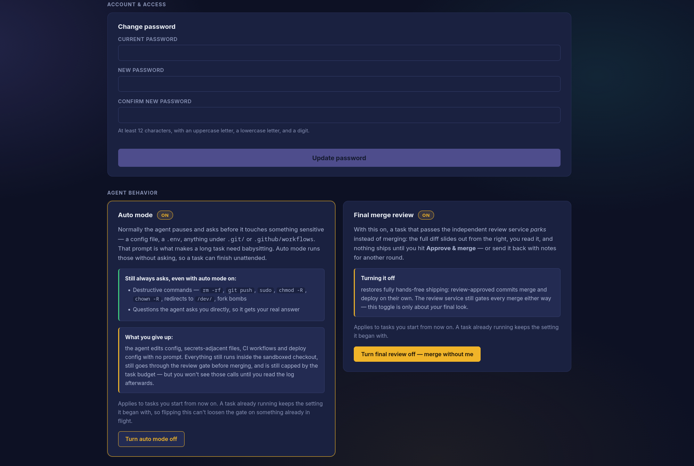</td>
</tr>
<tr>
<td><b>Every role is a named alias you can repin.</b> Planner, coder, investigator and
test-writer each show live pricing and an optional pinned provider, so a swap is one dropdown
rather than a config edit.</td>
<td><b>The two switches that decide how much rope the agent gets.</b> Auto mode lets a task
finish unattended; final merge review keeps a human between an approved diff and your live
repo. Each one spells out exactly what you give up.</td>
</tr>
<tr>
<td>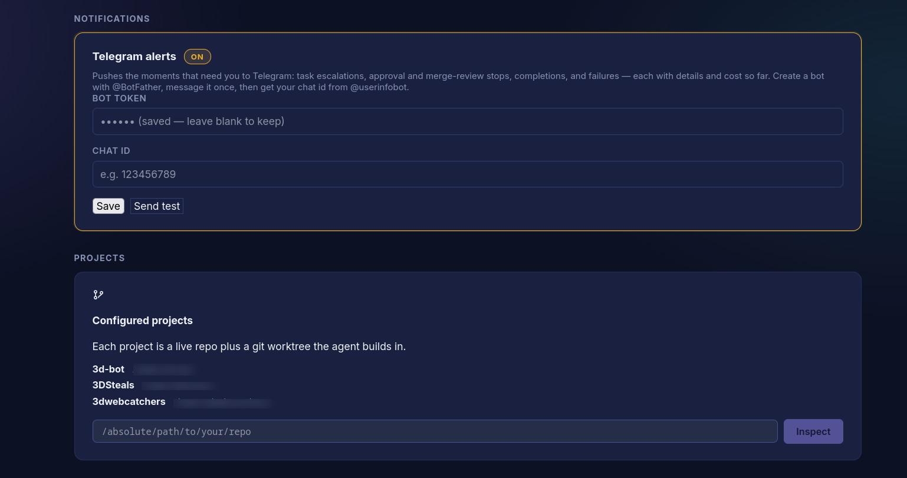</td>
<td>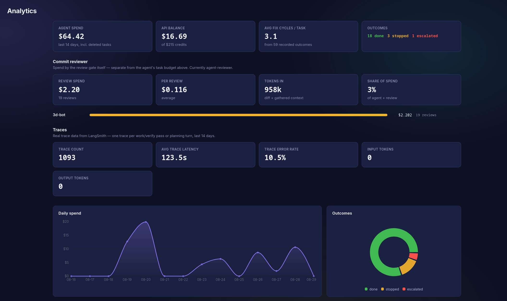</td>
</tr>
<tr>
<td><b>Add a project by pointing at a directory.</b> Each one becomes a live repo plus a git
worktree the agent builds in. Telegram alerts are optional and cover task events and service
restarts.</td>
<td><b>What it cost and what came of it.</b> Spend against your API balance, average fix cycles
per task, and outcomes split into done / stopped / escalated.</td>
</tr>
<tr>
<td>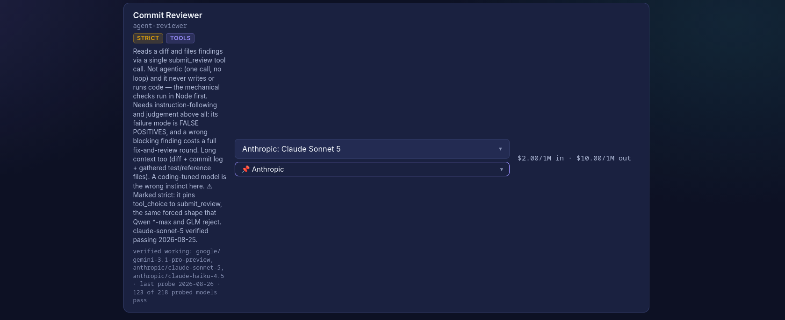</td>
<td>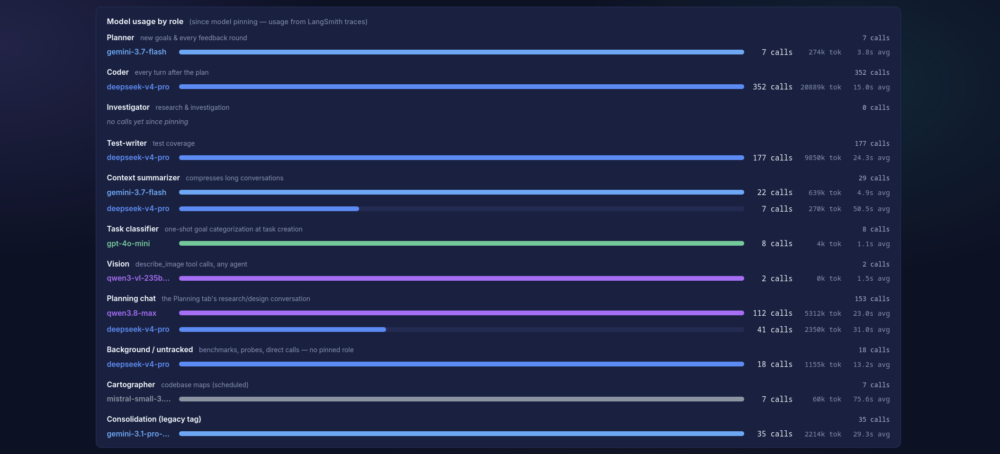</td>
</tr>
<tr>
<td><b>Models are probed, not assumed.</b> Each role lists which models actually pass its
requirements — strict tool calling, structured output — so you find out here rather than
mid-task.</td>
<td><b>Where the tokens actually went.</b> Per-role model usage with call counts, tokens and
average latency, so an expensive role is visible instead of inferred.</td>
</tr>
<tr>
<td>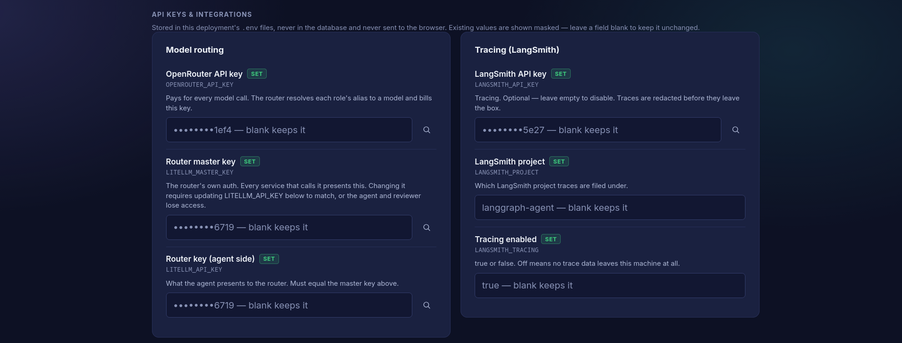</td>
<td>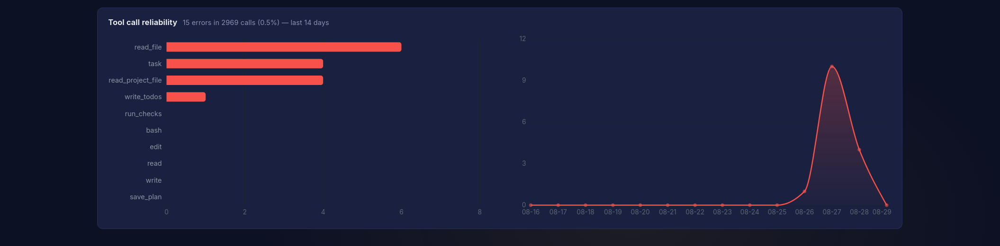</td>
</tr>
<tr>
<td><b>Credentials live in .env, never the database.</b> Existing values come back masked to
their last four characters — enough to confirm which key is installed, not enough to use it.</td>
<td><b>Tool reliability over time.</b> Errors broken down by tool, so a model that has started
failing a specific call shows up as a trend rather than a bad day.</td>
</tr>
</table>

<details>
<summary>More: planning-chat routing, support roles, SMTP</summary>

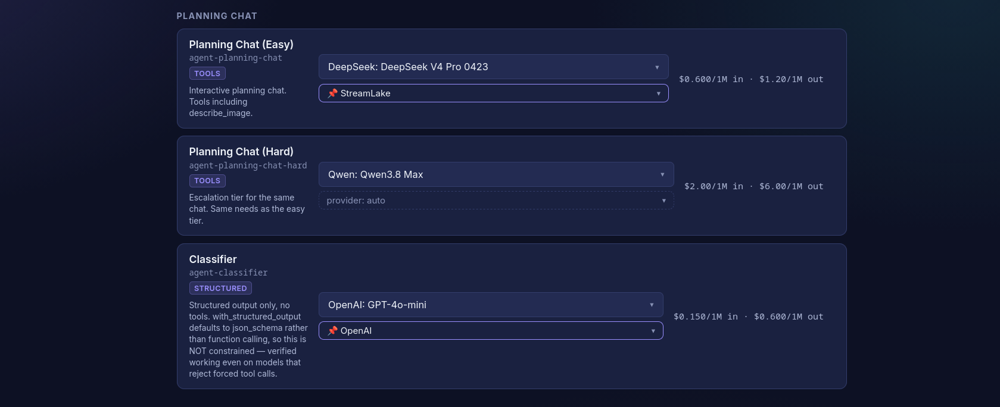

Planning chat runs a two-tier split — an everyday model plus a harder one that a turn escalates
into — with a classifier deciding which. The escalation is sticky upward within a session, so a
short follow-up can't quietly downgrade the model mid-plan.

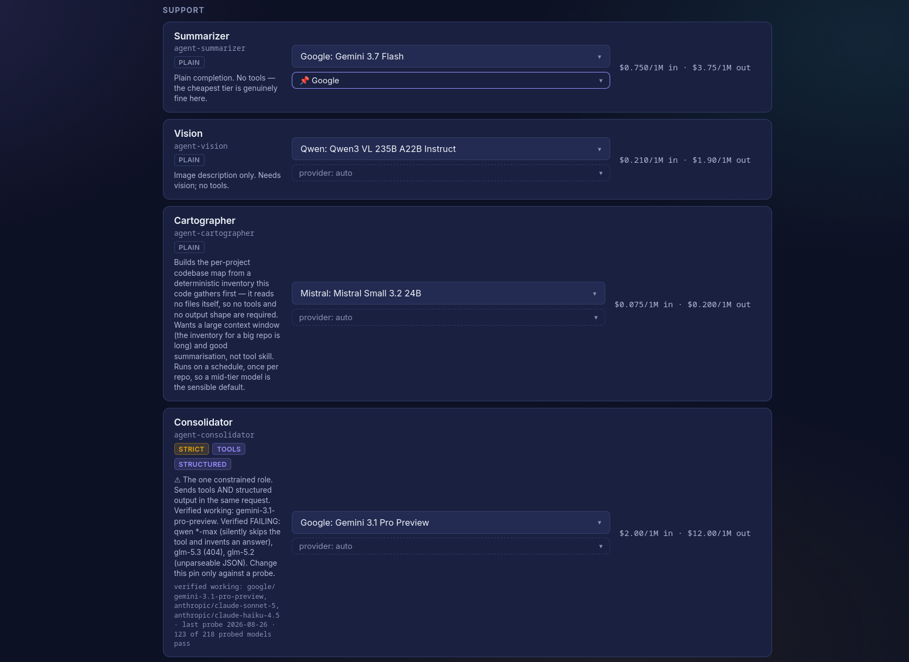

Support roles: summarizer, vision, cartographer and consolidator, each with the capability badges
its job requires.

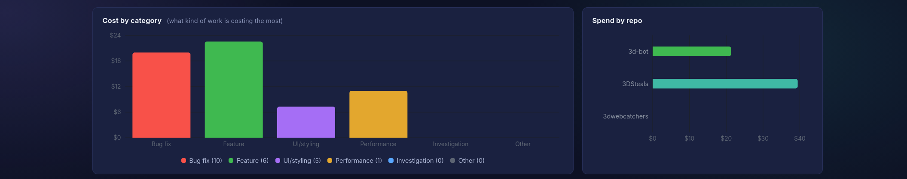

Spend broken down by the kind of work (bug fix, feature, UI, performance) and by repo, so you can
see which category is actually eating the budget.

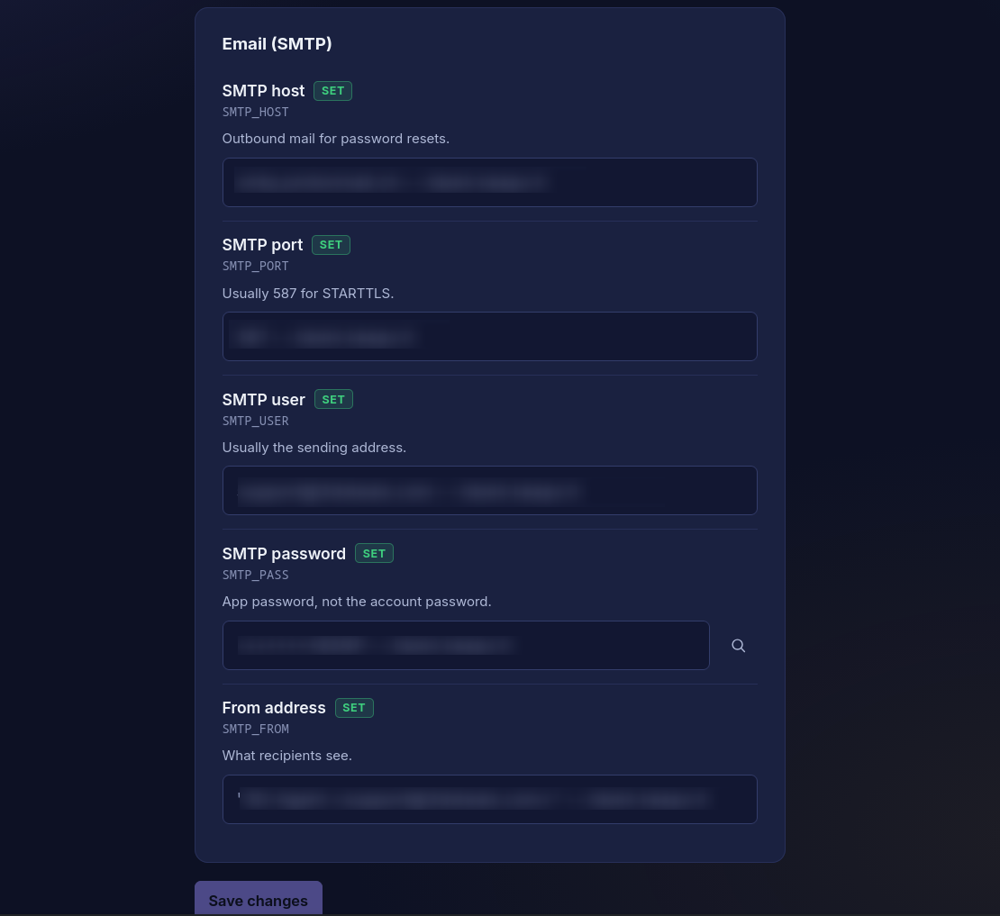

Outbound mail is optional and only used for password resets.

</details>

## Contents

- [How a build task runs](#how-a-build-task-runs)
- [Planning Chat](#planning-chat)
- [Dashboard](#dashboard)
- [Telegram alerts](#telegram-alerts)
- [Memory](#memory)
- [Model routing](#model-routing)
- [Auth](#auth)
- [Attachments](#attachments-images-pdfs-csvs)
- [Repo layout](#repo-layout)
- [Running it](#running-it)
- [Configuration](#configuration)
- [Testing](#testing)
- [Tracing and secret redaction](#tracing-and-secret-redaction)
- [Connection resilience](#connection-resilience)

## How a build task runs

`agent/outer_graph.py` wires a small, two-node graph around a deepagents agent
(`agent/deep_agent.py`):

```
START → work → verify_and_ship ──(checks/review fail)──→ work (loop, same inner thread)
                    │
                    └──(checks pass + review READY)──→ merge_and_deploy → END
```

- **`work`** (`agent/nodes/work.py`) drives the deep agent's own tool-calling loop against a
  sandboxed checkout (`docker/agent-sandbox/` — only the target repo is mounted, so a shell command
  can't reach other projects or host secrets). It plans via `write_todos` and can delegate to two
  subagents: **investigator** (read-only research — no write/edit/shell tools at all) and
  **test-writer** (writes tests, required to run the checks itself before reporting done). A
  `run_checks` tool lets it run the project's real typecheck/lint/test suite itself mid-task — the
  same commands the gate will run — so it finds its own breakage rather than learning about it a
  full round-trip later.
- **`verify_and_ship`** (`agent/nodes/verify_and_ship.py`) is the actual gate. It always re-runs the
  real typecheck/lint/test suite itself — the agent's own "done" status carries no authority here.
  A pass with a real diff produces one commit on the task's own branch `agent/<task-id>`, handed to
  an independent review service. The review unit is that **branch plus its merge-base**, fixed at the
  fork point — not "whatever the sandbox HEAD is now". The old model compared two HEADs and inferred
  the rest, which produced inverted diffs whenever live moved ahead: a branch's additions read as
  deletions of everything live had gained since, and that manufactured two `blocking` findings
  against a commit that had in fact *added* the settings it was accused of removing.
  From there:
  `NEEDS_FIXES` loops back to `work` with the findings; `READY` merges and deploys.
- **The plan has to be finished before anything is committed.** If the agent's own `write_todos`
  list still has open items, the gate holds the commit and sends it back to finish, naming what's
  left. Committing mid-plan means the review service reviews a deliberately-incomplete change and
  correctly reports the not-yet-written pieces as defects — bouncing the task on findings that
  describe scheduled work. It's a nudge budget, not a hard gate: a model that stops maintaining its
  own list can't strand working code as an uncommittable diff forever.
- Two limits the model can't override: a **budget ceiling** (`BudgetGuardMiddleware`, checked after
  every model call, on both the coordinator and every subagent) and an **iteration/retry ceiling**
  on the work/verify loop.
- **`ask_user`** lets the agent pause and ask the operator a clarifying question mid-task instead of
  guessing, using the same human-in-the-loop interrupt that gates approval-required actions.
- **A task is never a dead end.** Escalated, stopped, budget-exhausted, or orphaned by a backend
  restart mid-run — each has a way back in. The full graph state lives in the checkpointer, so
  resuming adds budget and continues the same inner thread rather than starting over. The dashboard
  detects an orphaned task (the store says "running" but nothing is driving it) and offers a resume
  instead of leaving it stuck looking busy forever.

## Planning Chat

A separate agent (`agent/planning_chat.py`) for research, design discussion, and scoping a project
before anything gets built. No write/bash access to the real repo — just research tools (web
search, a headless-browser `browse_page` with screenshots, `describe_image`, read-only access to
your other projects) and a `save_plan` tool. "Build Now" hands a finished plan to the real build
pipeline above, as if it had been typed in directly.

**Two models, chosen automatically per turn** (pins are dashboard-editable; current picks shown):

| Difficulty | Model (dashboard alias) | Used for |
|---|---|---|
| EASY (default) | `agent-planning-chat` — DeepSeek V4 Pro | Research, design/UX chat, everyday questions |
| HARD | `agent-planning-chat-hard` — Claude Sonnet 5 | Bug hunting, debugging, genuinely hard problems |

The HARD pin carries `cache_control_injection_points` in the router config — Anthropic prompt
caching is explicit, and without those breakpoints every call would pay full input price; with
them the append-only conversation re-reads from cache at ~10% of the input rate. The EASY pin's
provider caches implicitly, no plumbing needed.

**Deliberate constraints, each earned by a real incident:**

- **No subagents.** `create_deep_agent` auto-adds a general-purpose subagent (and its `task` tool)
  even when none are declared; planning hides it at both the schema and execution layer
  (`agent/middleware/hidden_tools.py`). A hidden delegation primitive once burned a 30-minute turn
  timeout on nested agent loops. Built-in `glob`/`grep` are hidden for the same reason — they
  search the agent's own memory/skills space, never the repo, and a model will loop on the
  misleading "No matches found" forever.
- **Codebase-map first.** The cartographer's per-project map (`/skills/codebase-map/SKILL.md`) is
  advertised in the prompt and read before any directory walking — one read replaces a dozen
  exploratory listings. The map refreshes every 30 minutes by cron (hash-gated: an unchanged repo
  costs a tree walk, no model call) and immediately after every merge+deploy.
- **Large files page.** `read_project_file` supports `offset`/`limit`; a truncated read says
  outright that re-requesting returns identical text and names the exact next call to make.
- **A per-turn dollar ceiling** (`PLANNING_TURN_BUDGET_USD`, default $4) on top of whatever the
  session already spent. Planning previously ran uncapped — the one agent with no budget was the
  one that once spent $7 on a single 157-call turn. On breach the draft plan and real cost are
  banked and the operator decides whether another turn's allowance is worth it.
- **A plan written as chat text is not lost.** A turn that ends with a plan-shaped final message
  and no `save_plan` call has that text adopted as the draft (narrow heuristic; an explicit save
  always wins).

Routing reuses the same classifier a build task is categorized with (`classify_task` in
`agent/classify.py`); a `"bug-fix"` category escalates to the hard model, and a small keyword floor
catches an explicit request for maximum effort. It's classified fresh every turn rather than once
per session, since a conversation can drift from casual design chat into a real bug report. Both
models get the identical tool list, memory, and permissions — only the model itself changes.

## Dashboard

One React/Vite app (`frontend/`), served by the backend itself. Live task and planning output
arrives over WebSockets, with a REST snapshot on every (re)connect — the socket only carries events
from the moment it opens, so the snapshot is what makes a page opened mid-task show real history
instead of starting blank. Multiple people can watch the same task at once; a second viewer
connecting doesn't disconnect the first.

- **Sidebar** — Planning sessions and build tasks, each grouped by the same six-way category the
  classifier assigns (`bug-fix`, `feature`, `ui-styling`, `performance`, `investigation`, `other`),
  with search. Running tasks sit in their own always-visible group at the top, so a refresh mid-task
  never buries the thing you're watching inside a collapsed category. Finished planning sessions
  archive into a collapsed group rather than growing one endless list.
- **Mobile** — the app works on a phone, not just a narrow desktop. A bottom tab bar puts every
  destination in the thumb zone (navigation previously lived only in the sidebar, which *is* the list
  pane on a phone, so reaching Analytics took three gestures), safe-area insets keep content clear of
  the notch and gesture bar, and tap targets meet the 44px floor. Verified by rendering at 412x915
  with a headless browser rather than by eye.
- **Consolidation status** — nightly memory-consolidation health on the Models tab: healthy, stale,
  failed, or never-run. That last state is the one a log tail can never show you: if cron stops
  firing entirely, an empty log looks exactly like a quiet night.
- **Analytics** (admin only) — spend by day, by project, and by category; the **commit reviewer's**
  own spend as its own section (the agent's budget and the gate's are different things, and until
  2026-08-25 the reviewer called OpenRouter directly and never read the response's `usage`, so its
  cost was structurally invisible here); per-role model usage with
  token counts and latency; tool-call reliability and error rates; and per-task outcomes. Backed by
  LangSmith run data plus the episodic records `verify_and_ship` writes.
- **Models** (admin only) — the model-pin editor described under [Model routing](#model-routing).
- **Users** (admin only) — create accounts, scope them to specific projects, revoke access.
- **Approvals inline** — when the agent hits a gated action or calls `ask_user`, the request appears
  in the task stream with approve/reject/answer controls; the answer goes straight back into the
  same paused thread.
- **Credit balance** — remaining router credit sits in the sidebar and turns red under 15%, so
  running dry is something you see coming rather than discover through a failing task.
- **Project filter** — a chip row above the sidebar lists (All + one per repo) filters Planning and
  Building together; category grouping stays intact underneath.
- **Task identity** — the task header carries click-to-copy `id:` and `commit:` chips, so "which
  task are we talking about" has a definite answer; every tool bubble in task and planning streams
  is timestamped, so stale scrollback and live activity are distinguishable at a glance.
- **Settings** — themed sections (Account & access / Agent behavior / Notifications / API keys &
  integrations) in a responsive two-up grid; the API-keys panel is one card per credential group
  (Model routing, Tracing, Email) with a single panel-wide save.

## Telegram alerts

Per-user opt-in (Settings → Telegram alerts: bot token + chat id; the token is write-only — the
backend returns only a masked view and the UI sends an unchanged-sentinel, so no user-serializing
endpoint can leak it). Every alert carries details **and cost so far**:

- task **escalated** (reason), **awaiting approval** (the exact prompt), **awaiting merge** (sha),
  **done**, **error** — one buzz per distinct stop, deduped across stream cycles; `running` and
  operator-initiated `stopped` never alert
- **planning turn failed** (error + session cost)
- task **auto-resumed** after a restart
- **service watch**: a lifespan-owned poller checks `pm2 jlist` each minute and alerts on any other
  service restarting, going down, or vanishing; the agent backend announces its own startups
  instead (its restart resets the watcher living inside it), which doubles as the deploy-landed
  signal

Alerts are best-effort by construction (`agent/notify.py`): a Telegram outage can never break or
slow the thing it is alerting about.

## Memory

Each project has its own persistent memory file, `/memories/AGENTS.md`, backed by the same Postgres
store as the LangGraph checkpointer. The agent can read and write it directly during normal work,
and it's shared across every task and planning session for that project. A second file,
`/org-memory/AGENTS.md`, is shared read-only across all projects.

- **Episodic memory** — `verify_and_ship` records a short summary (goal, outcome, cost, review
  verdict) at the end of every task. Not loaded into context by default; it feeds consolidation.
- **Consolidation** (`agent/consolidation.py`, run nightly via
  `scripts/consolidation-cron.sh`) reads a project's recent episodes plus its current memory and
  distills durable patterns into an updated memory file, skipping one-off noise.

  It uses `ProviderStrategy` for structured output, not a bare schema. Passing the schema alone
  resolves to `AutoStrategy`, which picks a **forced tool call** — and every OpenRouter provider for
  the `qwen*-max` family rejects `tool_choice=required/object` while the model is in thinking mode.
  That failed the nightly run for any project with episodes to consolidate, silently: projects with
  nothing to do short-circuit before the tool call and return success, so the log looked healthy.
  Probed on the real shape, `bare(Auto)` and `ToolStrategy` both FAIL on `qwen3.8-max` where
  `ProviderStrategy` passes.

  It also **fails loudly** now. `run_consolidation.py` exits non-zero with a banner naming the failed
  projects, and the cron wrapper writes `data/last_consolidation.json` for the dashboard's
  consolidation panel. Previously it printed a line and exited 0, which is why a broken run was
  indistinguishable from a healthy one.
- `scripts/seed_memory.py` seeds a project's initial memory. Live memory lives in Postgres, not in
  the repo — `memory/` holds only `*.example.md` templates showing the expected shape; real
  per-project memory files are gitignored.
- **Skills** (`skills/`) hold larger, situational domain knowledge that would bloat the memory file
  if always loaded — only a name and one-line description sit in the system prompt by default, and
  the agent reads the full skill file itself when a task actually needs it. The repo is the source
  of truth: authored skills live at `skills/<name>/SKILL.md`, vendored external ones under
  `skills/vendor/<name>/` (pinned + reviewed, see each PROVENANCE.md), and
  `scripts/seed_skills.py` deploys them to the project stores (re-running is the upgrade path).
  `webapp-testing` (vendored from anthropics/skills, Apache-2.0) plus Playwright/Chromium in the
  sandbox image lets the build agent render a frontend headlessly, screenshot it, and READ the
  screenshot with `describe_image` — UI work is verified visually, not just by compile.

## Model routing

Every model the agent uses is a named alias (`agent-planner`, `agent-coder`,
`agent-investigator`, `agent-test-writer`, `agent-summarizer`, `agent-vision`,
`agent-consolidator`, `agent-classifier`, `agent-planning-chat`, `agent-planning-chat-hard`,
`agent-demo-chat`, `agent-reviewer`) pinned in a shared LiteLLM router config. They're edited from the **Models** tab in the dashboard
(`GET`/`POST /api/model-config`) — swapping a role's model is a dashboard action plus a router
restart, no code change or redeploy. `agent/model_config.py` only ever touches these `agent-*`
entries; the router config is shared with other services, and edits are a surgical text
replacement so everything else in the file is untouched.

### Picking a model for a role

The Models tab marks every role on three axes, because they fail independently:

| axis | meaning |
|---|---|
| `tools` | the role hands the model callable tools |
| `structured` | the role constrains the output shape |
| `strict` | the model is **forced** into a response shape — tools + structured output in one request (Consolidator), or `tool_choice` pinned to a function (Reviewer) |

`strict` is the axis that actually restricts your choice, and **only two roles have it**. Everywhere
else, pick freely.

OpenRouter's catalog cannot answer the strict question. `qwen3.8-max` advertises `tools`,
`tool_choice`, `structured_outputs` **and** `reasoning` — byte-identical to
`gemini-3.1-pro-preview`, which works — and its per-endpoint data claims the same.
`supported_parameters` is a flat union across providers and cannot express a refused *combination*.
Only a real request settles it, so `scripts/probe_forced_tool_call.py` sends the actual shape and
caches the result; the Models tab has a **Refresh model list** button that re-runs it.

Verified for the strict roles (2026-08-25): `gemini-3.1-pro-preview`, `claude-sonnet-5` and
`claude-haiku-4.5` pass. `qwen3.8-max` fails by returning 200, silently skipping the tool and
inventing an answer — the dangerous variant. `glm-5.3` fails with a 404, `glm-5.2` with unparseable
JSON.

All `agent-*` pins carry OpenRouter's `require_parameters`, which routes only to providers
supporting every parameter in the request. Compliance is **per-provider** and OpenRouter
load-balances, so the same model can pass one run and fail the next — treat the probe as a strong
filter, not a guarantee, and pin the provider explicitly for anything that must not break.

The coordinator splits its own work between two of those roles deterministically, no classifier
involved: the first turn of a fresh thread (writing the plan) goes to `agent-planner`; every turn
after that goes to `agent-coder` (`agent/middleware/model_pin.py`).

## Auth

Username/password with TOTP 2FA (`agent/auth.py`): argon2id password hashing, RFC 6238 TOTP with
one-time recovery codes, and a single opaque session cookie that's revocable server-side rather
than a JWT. Per-user repo access is an explicit allow-list for a restricted account, or
unrestricted for `role="admin"`. The first admin account is seeded automatically on first startup
with a random password, printed once to the server log and required to be changed at first login
(see `ADMIN_EMAIL` below).

## Attachments (images/PDFs/CSVs)

Both the build-task composer and Planning Chat can attach reference files through the same
`/api/uploads` endpoint. Files land in the target repo's sandbox under `.uploads/<batch>/`,
excluded from git so they never appear in a diff or commit. A PDF gets a sibling `.txt` with
extracted text; images are read through the agent's `describe_image` tool. The upload manifest is
appended only to what the model sees, never to the visible chat text or to what gets classified.

## Repo layout

```
agent/
  server.py            FastAPI app -- routes, WS streams, background task runners
  outer_graph.py        the 2-node work / verify_and_ship graph
  graph.py               shared infra: Postgres checkpointer + store, per-project lock
  deep_agent.py          per-task deepagents factory (tools, memory backend, subagents)
  planning_chat.py       the Planning Chat agent
  auth.py / mailer.py    login/2FA/session/password-reset
  classify.py            task/turn categorization, also drives Planning Chat routing
  model_config.py        reads/edits this agent's model pins in the shared llm-router config
  consolidation.py       background memory-consolidation agent
  config.py              env-var config + PROJECTS (which repos this agent can target)
  nodes/                 work.py, verify_and_ship.py
  middleware/            budget_guard.py, model_pin.py
  tools/                 files, shell/bash, git, review_gate, planning_tools, vision, checks...
docker/agent-sandbox/    the container image build tasks' bash/edit tools run inside
frontend/                React + Vite dashboard
memory/                  *.example.md templates only -- live memory is in Postgres, not here
skills/                  on-demand skill files (incl. a vendored reasoning skill under vendor/)
services/                the rest of the system — one deployable each, all in this repo
                         because they are one piece and change together
  commit-reviewer/       the independent review gate (its own pm2 process)
  agent-review/          review dashboard + gated merge/deploy control
  llm-router/            shared LiteLLM proxy; every model call routes through it
scripts/                 seeding, backfills, store-key migration, the consolidation
                         runner + cron wrapper, and the forced-tool-call probe
tests/                   pytest suite
```

## Repo shape

Four deployables live here: the agent itself and the three services under `services/`. They are one
repo because they are one system — the review gate is meaningless without the agent, the dashboard is
meaningless without the gate, and all three call the router. They change together, so they version
together.

They still run as **separate pm2 processes** with separate ports and separate failure domains; the
shared repo is about history and review, not about coupling them at runtime. The demo/portfolio
chatbot is deliberately *not* here — it is a public service with no repository access and its own
lifecycle.


## Running it

```bash
git clone https://github.com/DJG3DK/3D-Agent.git
cd 3D-Agent
./install.sh
```

The installer checks prerequisites, generates secrets in the right format, writes both `.env`
files, creates the database, builds the sandbox image and the dashboard, and is safe to re-run.
**[INSTALL.md](INSTALL.md) is the full guide** — read §5 there before onboarding your first
project, since that step decides which of your test commands an unattended agent is allowed to
run.

What you need on the box: **Python 3.12+, Node 20+, Docker, Postgres, pm2** (optional) — and an
OpenRouter API key, which is the only paid dependency.

<details>
<summary>Manual bring-up, if you'd rather not use the installer</summary>

Order matters, because each layer depends on the one before it:

```bash
# 0. Postgres — the checkpointer and store both need it
createdb three_d_agent          # then put the DSN in .env

# 1. The sandbox image — the agent's bash/edit tools run inside this container.
#    Without it, the FIRST tool call of the first task fails.
docker build -t 3d-agent-sandbox:latest docker/agent-sandbox/

# 2. The model router — everything resolves model aliases through it
cd services/llm-router
python -m venv venv && venv/bin/pip install -r requirements.txt
cp .env.example .env            # OpenRouter key + a master key you generate
venv/bin/litellm --config config.yaml --port 4000 &

# 3. The agent
cd ../..
python -m venv .venv && source .venv/bin/activate
pip install -r requirements.txt
cp .env.example .env            # fill in real values -- see Configuration below
                                # LITELLM_API_KEY must equal the router's master key
cp projects.example.json projects.json   # point at your own project checkouts
uvicorn agent.server:app --host 127.0.0.1 --port 8100

# 4. (optional) the review gate and its dashboard
cd services/agent-review && npm install && node server.js &
node services/commit-reviewer/reviewer.js &          # zero npm dependencies
```

The first admin login is printed once to the server log on first startup (see `ADMIN_EMAIL`).

</details>

Paths follow the checkout — nothing is hardcoded to one install location — and per-project
configuration lives in `projects.json` (written by the onboarding wizard), not in source.

In production this runs under pm2 (`ecosystem.config.js`) as a single process —
`agent/server.py` mounts `frontend/dist` itself, so there's no separate frontend process. Rebuild
`frontend/dist` and restart the backend to deploy a frontend change.

`index.html` is served `no-store` while `/assets/*` is served `immutable, max-age=1y`. That split
matters: the bundle filenames are content-hashed, so they're safe to cache forever, but `index.html`
is the file that *names* the current bundle. Left cacheable, a browser will happily keep serving the
previous deploy's JS long after the new one shipped.

Frontend:

```bash
cd frontend
npm install
npm run dev       # dev server
npm run build     # production build -> frontend/dist
```

## Configuration

All config is environment variables, loaded from `.env` (see `agent/config.py`). Copy
`.env.example` and fill in real values. `.env` is gitignored and must never be committed.

| Variable | Purpose |
|---|---|
| `LANGGRAPH_PG_DSN` | Postgres DSN for the checkpointer, store, and auth tables |
| `LITELLM_BASE_URL` / `LITELLM_API_KEY` | The LiteLLM router this agent's model aliases are pinned in |
| `MODEL_PLAN` / `MODEL_EXECUTE` / `MODEL_REFLECT` | Required at startup but no longer read by the current pipeline, which routes through the `agent-*` aliases above instead |
| `DEFAULT_BUDGET_USD` | Default per-task cost ceiling |
| `API_PORT` | Port `uvicorn` binds |
| `AUTH_SECRET_KEY` | AES-GCM key encrypting TOTP 2FA secrets at rest (not sessions — those are opaque tokens). Must decode to 16/24/32 raw bytes: `python -c "import base64,secrets;print(base64.urlsafe_b64encode(secrets.token_bytes(32)).decode())"`. `openssl rand -hex 32` yields 48 bytes and will not work. Rotating it locks out every 2FA user permanently |
| `ADMIN_EMAIL` | Address the first admin account is seeded with (defaults to `admin@example.com`) |
| `SMTP_HOST` / `PORT` / `USER` / `PASS` / `FROM` | Outbound mail for password-reset codes. Sending is optional, but all five keys must be present and `SMTP_PORT` must be numeric — see [INSTALL.md §6a](INSTALL.md#6a-email-smtp) |
| `LANGSMITH_TRACING` / `LANGSMITH_API_KEY` / `LANGSMITH_PROJECT` | Optional tracing |
| `LANGCHAIN_OPENAI_STREAM_CHUNK_TIMEOUT_S` | Streaming chunk timeout |
| `AGENT_PROJECT_ROOTS` | Colon-separated roots a project may be onboarded from (default `/home`). Onboarding grants an agent bash and write access to what it points at, so this is the boundary — the admin check is only *who may ask* |
| `AGENT_SANDBOX_ROOT` | Where agent worktrees are created (default `/home/agent-workspaces`). Server-owned: never accepted from a request |

`projects.json` (gitignored; `projects.example.json` is the template) lists the repos this
deployment can target and each one's sandbox/live checkout paths.

## Adding a project

`projects.json` is the single source of truth. Both node services read it through
`services/shared/projects-config.js`, so a project added once is picked up by the agent,
the commit reviewer, and the deploy service without editing any of them.

Two front doors, one implementation (`agent/provisioning.py`):

- **Dashboard** — Settings → Projects (admin only). Enter an absolute path, review what
  was detected, create.
- **CLI** — `.venv/bin/python scripts/add_project.py /path/to/repo` (add `--yes` to take
  the recommended answers for a headless install).

Both run the same three phases:

1. **Inspect** (read-only) — confirms it's a git repo, detects the package manager and
   the repo's own `typecheck`/`lint`/`test` scripts, expands monorepo workspaces, finds
   gitignored files that look like credentials, and looks for pm2 apps serving the path.
2. **Confirm** — everything uncertain is *proposed*, not applied. This step is a safety
   gate, not a formality: any test script that makes network calls arrives **disabled**
   with the reason attached, because a suite that talks to a live service can act on
   production. (This deployment learned that from a `test:routes` script that POSTed real
   trade orders at the running bot.) A repo that declares its own `test:review` script is
   trusted over its aggregate `test`.
3. **Provision** — creates the git worktree, writes the `projects.json` entry, reloads it
   into the running process (no restart needed), seeds starter project memory, and builds
   the codebase map. Each step reports independently, so a partial failure is visible
   rather than looking like nothing happened.

### Onboarding is contained, not merely authenticated

Admin answers *who may ask*; these rules bound *what the answer may be*, because
onboarding is the most powerful action in the dashboard — it hands an agent bash and
write access to a directory and makes the review service copy the files named as secrets
into a worktree.

- The path must resolve inside `AGENT_PROJECT_ROOTS`, judged **after** symlink
  resolution, so a link inside an allowed root that lands outside it is refused.
- The worktree location and the project name are derived by the server
  (`AGENT_SANDBOX_ROOT` + the directory's basename). Neither is accepted from the
  request; `sandbox` used to be, which made it an arbitrary-filesystem-write primitive.
- Provisioning **re-runs detection server-side** and accepts the operator's answers only
  as a *subset* of what it just proposed. `checks` and `build` are executed verbatim by
  the review and deploy services, so a submitted check is matched by name and replaced
  with the server's own command — a client cannot author one.
- `secretFiles`, mounts and `db_env_file` must be repo-relative and inside the project;
  traversal (`../../root/.ssh/id_rsa`) and absolute paths are refused.
- The agent's own repository is refused outright (including via a worktree of it), and
  every provision is logged with the operator's email.

Configs written by hand keep precedence: `services/shared/projects-config.js` merges
`projects.json` **under** each service's built-in map, so hand-tuned entries are never
overwritten by generated ones.

## Testing

```bash
pytest
```

Covers the graph nodes (including the commit gate's plan-completion and stale-review handling),
budget guard, model routing, Planning Chat's model selection and tool/memory parity, memory-key
consistency, auth, and uploads — against in-memory stores and mocked model calls, no live Postgres
or real model calls required.

## Tracing and secret redaction

Tracing is optional (`LANGSMITH_TRACING`), but turning it on the zero-code way ships every trace
payload — full prompts, tool call arguments, and tool call **results** — to a third-party server
verbatim. That matters here specifically because the agent's `bash` tool can read arbitrary files
inside its sandbox. The human-in-the-loop gate gates a call by its *path and command* before it
runs; it has no idea what the output will contain, so a secret sitting in an unremarkably-named
file could still land in a `ToolMessage` and go straight out in a trace.

`agent/observability.py` installs a redacting LangSmith client as the backstop: an anonymizer runs
over every payload before it leaves the process, scrubbing key/value pairs with credential-shaped
names, database DSN passwords (keeping host/port/dbname, which aren't secrets), bearer tokens, JWTs,
cloud access keys, and whole PEM private-key blocks. It also stamps per-task metadata so a specific
task's trace is findable in the UI. Covered by `tests/test_observability.py`, which asserts against
real-shaped (fake) secrets rather than trusting the patterns by eye.

## Connection resilience

`agent/graph.py` uses a `psycopg_pool.AsyncConnectionPool` (with connection-liveness checks and
idle/lifetime recycling) for the checkpointer and store, rather than a single long-lived
connection, so a Postgres restart doesn't take the app down with it. `_read_with_retry` in
`agent/server.py` adds a retry-once wrapper around the endpoints the frontend polls, as a second
layer of defense.

- **WS heartbeat** — both stream endpoints ping every 20s when quiet. A long model call means a
  long silent socket, and NAT/middleboxes kill idle TCP without telling either end; the ping keeps
  every hop alive and turns a genuinely dead socket into a prompt close event instead of a silent
  stall.
- **Auto-reconnect** — both the task and planning streams reconnect with backoff on an unexpected
  drop and re-hydrate from the REST snapshot to fill whatever the dead socket missed. Live display
  state that only existed as stream events (running cost, the plan step strip) is mirrored into
  the task's store record, so a refresh or task switch mid-pass rebuilds faithfully.
- **Restart survival** — a deploy restart drains in-flight planning turns before the DB pools
  close (their teardown banks the draft plan and spend), and on startup the server auto-resumes
  any task orphaned by the restart: same checkpoint, no replanning, +40 iteration headroom, no
  added budget. A task that made no progress since its last auto-resume is left for a human
  instead of crash-looping. Escalated and operator-stopped tasks are never auto-resumed.

## Contributing & security

- [CONTRIBUTING.md](CONTRIBUTING.md) — setup, house style, and what makes a useful PR.
- [SECURITY.md](SECURITY.md) — private vulnerability reporting, the threat model (what the agent
  is *supposed* to be able to do vs. what counts as a real vulnerability), and how to deploy
  safely.

## License

**PolyForm Noncommercial 1.0.0** — source-available, not open source. Read it, learn from it, run
it, and modify it freely for any noncommercial purpose. Using it commercially requires a separate
license — open an issue on GitHub to start that conversation.
